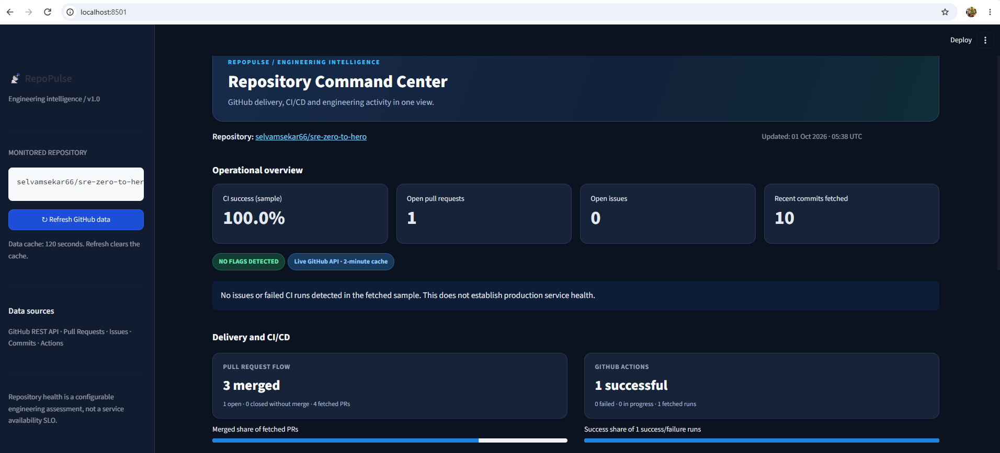
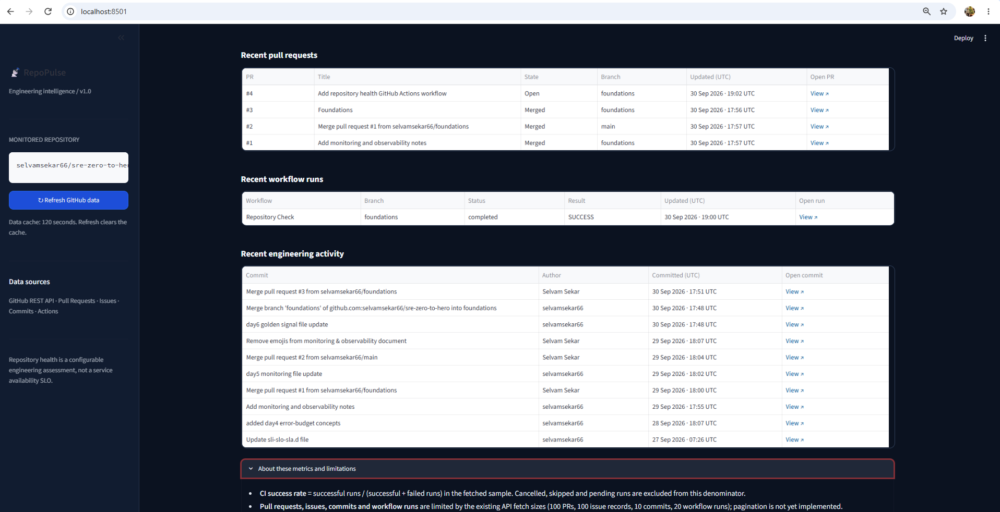

# RepoPulse

## GitHub Repository Engineering Intelligence

RepoPulse is a Python and Streamlit application that uses the GitHub REST API to provide visibility into repository engineering activity, pull requests, issues, commits, and GitHub Actions.

The project was built as a practical learning project to explore GitHub API integration, Python automation, engineering health metrics, and SRE-oriented dashboard design.

---

## Dashboard

RepoPulse provides a centralized view of:

- Repository information
- Pull request activity
- Issue activity
- GitHub Actions
- CI success rate
- Recent workflow runs
- Recent engineering activity
- Repository engineering signals

## Live Demo

[Open RepoPulse Dashboard](https://repopulse-dashboard.streamlit.app)

### Dashboard Preview



### Engineering Activity


---

## Architecture

```text
GitHub REST API
       |
       v
   config.py
       |
       v
 github_api.py
       |
       +----------------------+
       |                      |
       v                      v
 API Data              Health Calculations
       |                      |
       +----------+-----------+
                  |
                  v
             Streamlit
                  |
                  v
          RepoPulse Dashboard
```

### Technology Stack

- Python
- GitHub REST API
- Requests
- Python-dotenv
- Streamlit
- GitHub Actions

### Features

#### Repository Visibility

- Repository name
- Stars
- Forks
- Default branch

#### Pull Requests

- Total pull requests
- Open pull requests
- Closed pull requests
- Merged pull requests
- Unmerged pull requests

#### Issues

- Total issues
- Open issues
- Closed issues

#### GitHub Actions

- Workflow runs
- Successful runs
- Failed runs
- In-progress runs
- CI success rate
- Recent workflow details

#### Engineering Activity

- Recent commits
- Commit author
- Commit timestamp
- Direct GitHub links

### Security

GitHub authentication is handled using a Personal Access Token stored in an environment variable.
The token is never stored in source code.

Example:

```bash
GITHUB_TOKEN=your_token
```

The .env file is excluded from Git using .gitignore.

### Local Setup

1. Clone the repository

```bash
git clone https://github.com/selvamsekar66/github-repo-health.git
cd github-repo-health
```

2. Create a virtual environment

```bash
python -m venv .venv
```

3. Activate the environment

Git Bash:

```bash
source .venv/Scripts/activate
```

4. Install dependencies

```bash
pip install -r requirements.txt
```

5. Configure GitHub authentication

Create a .env file:

```bash
GITHUB_TOKEN=your_github_token
```

6. Run the application

```bash
streamlit run app.py
```

Open:

```text
http://localhost:8501
```

### Project Structure

```text
github-repo-health/
|
├── .github/
│   └── workflows/
|
├── app.py
├── config.py
├── github_api.py
├── requirements.txt
├── LICENSE
├── README.md
└── .gitignore
```

### Important Note

RepoPulse provides repository-level engineering signals.
It is not an application performance monitoring system and does not represent production service availability or an SLO.
The metrics should be interpreted within the context of the GitHub repository and the data collected by the application.